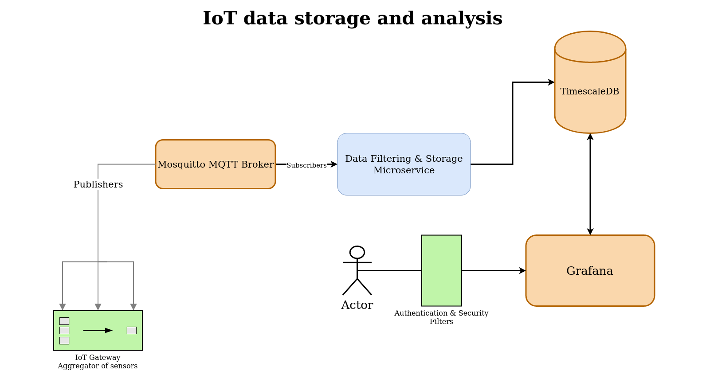

# IoT Data Platform
A project which ingests, stores and analyzes data coming from
an IoT Gateway which aggregates data from rooms of a smart home.

## Description
The data platform is composed of 4 microservices:
- MQTT Broker
- Data Filtering & Storage Microservice
- TimescaleDB
- Grafana

There is also an additional microservice which simulates the behaviour of
an IoT Gateway that can be deployed separately from the data platform. This
is going to be the main data provider for the platform.

### IoT Gateway simulator
The simulator will publish data for a specific room once every 5 minutes.
The data provided should simulate realistic metrics as much as possible.
Data will be published on the “home” channel.
It needs to have the necessary configuration to authenticate to the MQTT broker.
It will sometimes provide corrupted data, null values etc. which should be filtered
out by the Data Filtering microservice.

### MQTT Broker
The broker needs to have an adequate QoS setup so that the IoT Gateway can authenticate as securely as possible. It also needs to be setup so that the IoT gateway and the Data Filtering & Storage Microservice can authenticate to it.

### Data Filtering & Storage Microservice
TODO

### TimescaleDB
TODO

### Grafana
TODO

## Build & Run
Will be using docker-compose to run the containers. Each microservice
has its separate Dockerfile.
TODO
